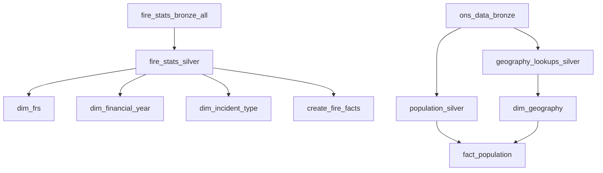

# Dagster Fire Project

A multi-layer data engineering pipeline built with **Dagster** that ingests, transforms, and models UK Fire & Rescue Service incident data alongside ONS population statistics.

---

## 📁 Project Structure

```text
dagster_fire_project/
├── fire_project/                    # Main Dagster package
│   ├── __init__.py                 # Package initializer
│   ├── definitions.py              # Dagster definitions (registers all assets)
│   └── assets/                     # Data pipeline layers
│       ├── bronze_layer.py         # Raw data ingestion (Fire Stats)
│       ├── ons_layer.py            # Raw data ingestion (ONS Population & Lookups)
│       ├── silver_layer.py         # Data cleansing & standardisation
│       └── gold_layer.py           # Dimensional modelling (Facts & Dimensions)
├── data/                           # Local data storage (census, etc.)
├── pyproject.toml                  # Build configuration
├── setup.py                        # Package dependencies
└── README.md                       # This file
```

---

## 🏗️ Architecture Overview

The project implements a medallion architecture with three distinct layers, orchestrated to run sequentially using Dagster dependencies:

### 🥉 Bronze Layer (Raw Ingestion)

- **`fire_stats_bronze_all`**: Web scrapes 30+ Fire Statistics datasets from gov.uk, handles retries/pauses, and stores them as Delta tables.
- **`ons_data_bronze`**: A "Hybrid Ingestor" that detects manual "Golden Source" CSVs (Nomis) in the Landing zone but actively scans the ONS website to alert on future data availability (2025+).

### 🥈 Silver Layer (Cleansed & Standardised)

- **`fire_stats_silver`**:
  - Standardises column headers (snake_case, removes prefixes).
  - Enforces numeric types for analysis columns.
  - Calculates Financial Year (e.g., "2023/24") from incident dates to align with government reporting standards.

- **`population_silver`**:
  - Unpivots (Melts) population data from "Wide" to "Long" format.
  - Imputes missing years (Windsorising) to create a continuous 2010–2025 timeline.

- **`geography_lookups_silver`**: Standardises headers for geographic hierarchy lookups (LSOA → MSOA → LAD → FRA).

#### 🥈 Silver Layer Updates (Data Enrichment & Patching)

**1. Statistical Midpoint Extraction**

To enable average response time and resource analysis, text-based range columns are now parsed into numeric estimates before type enforcement takes place.

**Logic**:

- Ranges ("6-20") --> Mean (13.0)
- Lists ("4, 5 or 6") --> Mean of all integers (5.0)
- Open Upper Bounds ("40 or more") --> Lower Bound (40.0) for conservative estimation
- Open Lower Bounds ("Up to 5") --> Half the upper bound (2.5)

**Affected Columns**: `vehicles`, `personnel`, `response_time`, `time_at_scene`, `damage_sqm`

**2. Geography Lookup Patching (LGR)**

Implements a hotfix for Local Government Reorganisation (LGR) to ensure historical LSOA codes map to current Fire Authorities.

**Problem**: ONS LSOA lookups often reference old Districts (e.g., Allerdale, Corby) which no longer exist in the LAD-to-FRS lookup file following 2021/2023 unitary mergers.

**Fix**: `geography_lookups_silver` now applies a dictionary map to re-route old LAD codes to new Unitary codes:

- **Cumbria (2023)**: Maps 6 legacy districts to Cumberland (E06000063) and Westmorland & Furness (E06000064)
- **Northamptonshire (2021)**: Maps 7 legacy districts to North and West Northamptonshire

# SOMERSET CHANGES (2023)

        # Old Districts -> New Unitary (Somerset Council)
        "E07000186": "E06000066", # Mendip -> Somerset
        "E07000187": "E06000066", # Sedgemoor -> Somerset
        "E07000189": "E06000066", # South Somerset -> Somerset
        "E07000242": "E06000066", # Somerset West and Taunton (2019-2023 code)
        # Safety catch for older pre-2019 codes
        "E07000190": "E06000066", # Taunton Deane (Pre-2019)
        "E07000192": "E06000066", # West Somerset (Pre-2019)

---

## 🛠️ Data Treatments & Assumptions

| Treatment               | Description                                                                                                       | Reason                                                                                     |
| ----------------------- | ----------------------------------------------------------------------------------------------------------------- | ------------------------------------------------------------------------------------------ |
| **Midpoint Estimation** | Text ranges (e.g., "10 to 15 mins") are converted to numeric midpoints (12.5) in the Silver layer                 | Enables calculation of "Average Response Time" and resource trends over time               |
| **Geography Patching**  | Legacy LAD codes for Cumbria (pre-2023) and Northamptonshire (pre-2021) are mapped to new Unitary Authority codes | Ensures historical incidents correctly join to the current Fire & Rescue Service hierarchy |
| **Financial Year**      | Derived from incident dates where possible. If date is missing, the source file's reported financial year is used | Aligns all datasets to the standard April-March reporting cycle                            |
| **Windsorising**        | Population data is backfilled to 2010 and forward-filled to 2025                                                  | Prevents "per capita" calculations from breaking due to missing census years               |

---

### 🥇 Gold Layer (Dimensional Model)

**Dimensions**:

- **`dim_geography`**: joins LSOA, LAD, and FRS lookups into a single Master Hierarchy.
- **`dim_frs`**: Implements Master Data Management (MDM) logic to de-duplicate Fire Service names and handle mergers (e.g., Hampshire & Isle of Wight).
- **`dim_financial_year`**: Master time dimension.
- **`dim_incident_type`**: Maps disparate datasets (e.g., "Road Vehicle Fires") to high-level categories (e.g., "Fire", "False Alarm").

**Facts**:

- **`fact_population`**: Aggregates population data to every geographic level (LSOA, MSOA, LAD, FRS) and converts calendar years to financial years.
- **`create_fire_facts`**: Promotes all silver datasets to Gold Facts (Fact_DwellingFires, etc.) with Smart Validation to check for referential integrity errors before publishing.

---

## 🚀 Getting Started

Prerequisites
Python 3.8+

Virtual environment recommended

Installation
Navigate to project directory:

PowerShell

cd C:\Users\jon_b\Dev\Fabric_project\dagster_fire_project
Install in development mode:

PowerShell

pip install -e ".[dev]"
Launch Dagster UI:

PowerShell

dagster dev
Open browser: Navigate to http://localhost:3000

## 📊 Data Sources

### Fire Statistics (Bronze Layer)

- **Source**: [GOV.UK Fire Statistics](https://www.gov.uk/government/statistics/fire-statistics-incident-level-datasets)
- **Format**: ODS (OpenDocument Spreadsheet)
- **Coverage**: Granular incident-level data including:
  - Dwelling fires & Building fires
  - Road vehicle fires & Outdoor fires
  - False alarms
  - Casualties & Fatalities

### ONS Population Data (Bronze Layer)

- **Source**: Manually downloaded from Nomis (ONS)
- **Location**: `C:\DataLake_JB\Landing\Nomis_Data\`
- **Files**:
  - `LSOA Populations 2011 to 2024.csv`
  - `LSOA to MSOA to LAD.csv`
  - `LAD to FRA.csv`

---

## 🔧 Key Features & Data Qualityity

### 🌐 Resilient Web Scraping

- Automatically crawls the gov.uk landing page to find the latest dataset URLs.
- Implements Politeness Delays (3s sleep) to avoid IP blocking.
- Uses BeautifulSoup to find "Master Files" vs individual year files.

### 🧠 Smart Data Validation (Gold Layer)

- The pipeline implements Quality Gates in the Gold layer.
- It checks every Fact table for valid Foreign Keys (financial_year, frs_code).
- It includes Exception Logic to whitelist datasets known to be missing these keys (e.g., Fire Fatalities do not have FRS codes for anonymity; Fire Stations do not have Financial Years), preventing false positive warnings.

### 🛡️ Master Data Management (MDM)

- **FRS Mergers**: Handles the operational merger of Hampshire and Isle of Wight by mapping legacy codes (E31000017, E31000021) to the new master code (E31000048) in the Gold Layer.
- **De-duplication**: Scans 14 years of file history to find the "Best" name for every Fire Service, preventing duplicate keys in the Dimension table.

### 🧹 Delta Lake Maintenance

- **OneLake Simulation**: Mimics the Microsoft Fabric architecture locally.
- **Vacuuming**: Automatically runs VACUUM commands after every write to prevent local disk bloat from historical file versions.

---

## 🎯 Asset Dependencies



---

## 📦 Dependencies

### Core Libraries

- **dagster** / **dagster-webserver**: Orchestration framework
- **pandas**: Data manipulation
- **deltalake**: Delta Lake read/write operations
- **requests** / **beautifulsoup4**: Web scraping
- **python-calamine**: High-performance ODS/Excel reader

### Full dependency list

See `setup.py` for complete requirements.

---

## 📝 Configuration Notes

### Encoding Handling

- ONS CSV files use `latin1` encoding due to special characters.
- Fire statistics ODS files are read with the `calamine` engine for speed.

### File Path Requirements

- Uses absolute Windows paths (`C:\DataLake_JB`) to simulate a storage root.
- **Race Condition Handling**: Assets use explicit string-based dependencies (`deps=["asset_name"]`) to ensure Silver files exist before Gold attempts to read them.

---

## ⚠️ Known Considerations

1. **Manual Data Downloads**: ONS population data is sourced manually to ensure the correct "2021 Census Based" revision is used.

2. **Header Detection**: The Bronze ingestor uses custom logic to scan for the anchor text "2021 super output area" to correctly identify the header row, rather than relying on fixed row numbers.

3. **Financial Year**: Mid-year population estimates (e.g., 2023) are mapped to the subsequent financial year (2023/24) to match Incident reporting.

---

## 📄 License

This project is for educational and research purposes.

```

```
